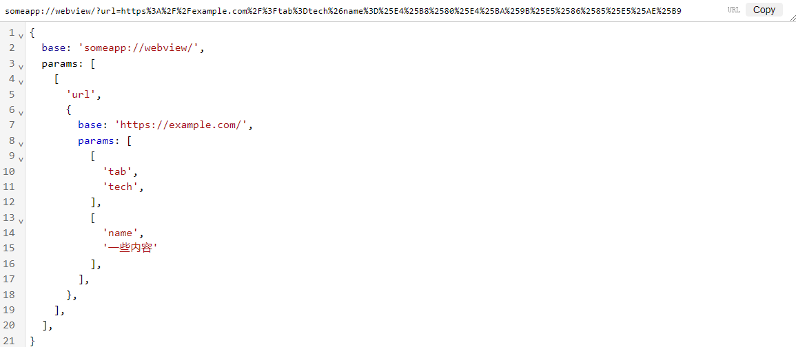

[meowtec.github.io/url-editor/](https://meowtec.github.io/url-editor/)

An editor for safely editing URLs or JSONs that contain JSON data.



## Examples

You have A URL, like this:

```
https://example.com/?tabtype=weibo&keyword=100%25
```

You can edit it using JSON5:

```js
{
  base: 'https://example.com/',
  params: [
    [
      'tabtype',
      'weibo',
    ],
    [
      'keyword',
      '100%',
    ],
  ],
}
```

Or a JSON like this:

```json
{
  "foo": 1,
  "data": "{\"bar\":12}"
}
```

Edit like this:

```js
{
  foo: 1,
  data: {
    '// complex-data-type': 'JSON',
    value: {
      bar: 12,
    },
  },
}
```
